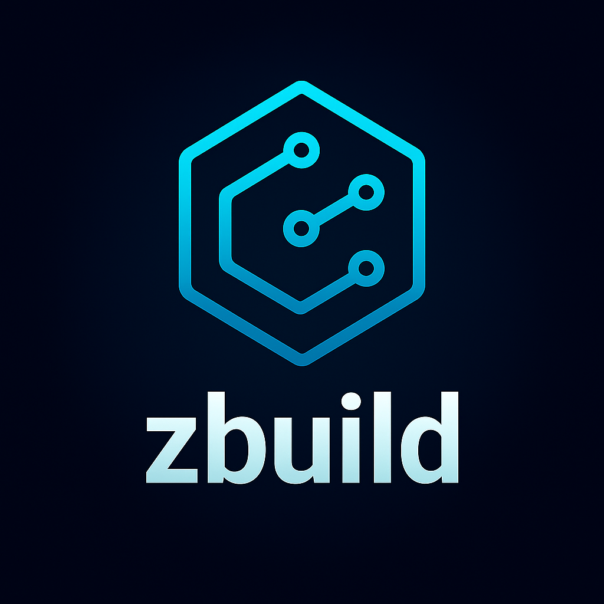

<div align="center">



# zbuild

[](https://ziglang.org/)
[](https://ziglang.org/)
[](https://github.com/ghostkellz/zbuild)
[](https://github.com/ghostkellz/zbuild)

Modern Build System for Zig with parallel processing, smart caching, and Rust integration

</div>

## 🚀 Features

- **⚡ Parallel Building** - Leverage multiple CPU cores for faster builds with configurable worker threads
- **👀 Watch Mode** - Automatic rebuilds on file changes for seamless development workflow
- **📊 Build Graph Visualization** - Generate and visualize dependency graphs using Graphviz
- **🏃 Performance Benchmarking** - Built-in benchmarking suite to analyze build performance
- **🗄️ Smart Caching** - Intelligent build artifact caching to skip unnecessary rebuilds
- **🌐 Cross-compilation** - Support for multiple target architectures
- **🦀 Rust Integration** - Seamless FFI with Rust crates via [Ghostbind](https://github.com/ghostkellz/ghostbind)

## 📦 Installation


### Zig Integration 
```bash
zig fetch --save https://github.com/ghostkellz/zbuild/archive/refs/heads/main.tar.gz
```
### From Source
```bash
git clone https://github.com/ghostkellz/zbuild.git
cd zbuild
zig build
```

### Zig Integration
```zig
// In your build.zig.zon
.{
    .name = "my-project",
    .version = "0.1.0",
    .dependencies = .{
        .zbuild = .{
            .url = "https://github.com/ghostkellz/zbuild/archive/refs/heads/main.tar.gz",
            .hash = "12345...", // Replace with actual hash
        },
    },
}
```

## 🛠️ Usage

### Basic Commands

```bash
# Build the project
zbuild build

# Build with parallel workers
zbuild parallel 8

# Watch for changes and auto-rebuild
zbuild watch

# Run tests
zbuild test

# Clean build artifacts
zbuild clean

# Initialize new project
zbuild init

# Generate build dependency graph
zbuild graph deps.dot

# Run performance benchmarks
zbuild benchmark
```

### Configuration

Create a `zbuild.json` file in your project root:

```json
{
  "targets": {
    "main": {
      "type": "executable",
      "source": "src/main.zig"
    },
    "test": {
      "type": "test",
      "source": "src/tests.zig"
    }
  },
  "dependencies": [],
  "cache": {
    "enabled": true,
    "directory": ".zbuild"
  }
}
```

## 🦀 Rust Integration

zbuild works seamlessly with [Ghostbind](https://github.com/ghostkellz/ghostbind) to integrate Rust crates:

```zig
const ghostbind = @import("ghostbind");

pub fn build(b: *std.Build) void {
    const exe = b.addExecutable(.{
        .name = "my-app",
        .root_source_file = .{ .path = "src/main.zig" },
    });

    // Add Rust crate
    ghostbind.addRustCrate(b, exe, .{
        .path = "rust_lib",
        .profile = .release,
        .features = &.{"async"},
    });
}
```

## 🔧 Development

### Building from Source

```bash
zig build
```

### Running Tests

```bash
zig build test
```

### Development with Watch Mode

```bash
zbuild watch
```

## 📈 Performance

zbuild is designed for performance:

- **Parallel execution** reduces build times significantly
- **Smart caching** avoids redundant work
- **Dependency graph optimization** minimizes unnecessary builds
- **Benchmark suite** helps identify bottlenecks

## 🤝 Contributing

Contributions are welcome! Please feel free to submit a Pull Request.

## 📄 License

This project is licensed under the MIT License - see the LICENSE file for details.

## 🔗 Related Projects

- [Ghostbind](https://github.com/ghostkellz/ghostbind) - Rust FFI bridge for Zig projects

---
